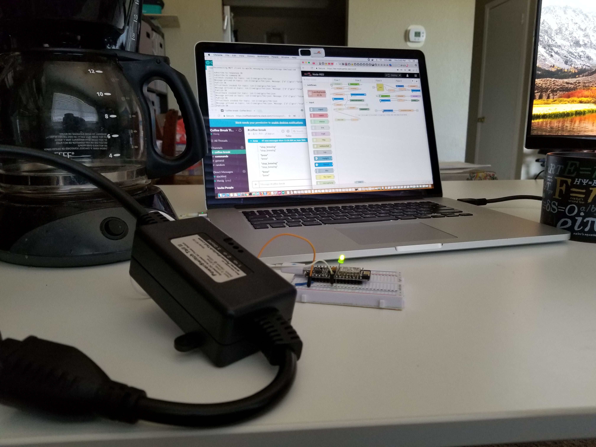

<b><u>Skill Level</u></b>: Beginner
 <b><u>N.B</u></b>: All services used in this repo are Lite plans. Don't forget to star this repo if you like it.

# Assistant Watson-Alex

## Introduction

The idea behind this project is to provide a hands-on fun workshop using Node-RED and Watson's cognitive solutions for audio conversations. Audio tends to have its own challenges and this step-by-step tutorial hopefully can help you enjoy coding and also target your goals through this experience.

This pattern uses the Car Dashboard Conversation workspace that comes by default when you create the Assistant (formerly Conversation) service. The reason is to avoid complications but you can always create or import your own conversation workspace, this might be a good idea to do a separate tutorial once this pattern gets consumed easily by developers.

After the completion of this tutorial, this application will record your talk and send it over to Watson's services to retrieve, based on your request, the weather data of a city.. Or can send commands and receive responses through a conversation, for example, to turn on lights or to play a music and many more. Then IFTTT will trigger events each time there's a request coming from the microphone and it will be posted on the Slack the specific event made.

If you'd like to watch the videos, I have one video shows how the coffee machine is brewing the coffee after command is sent and the other one does not include the coffee machine but it behaves as if it was there. The reason for the second video is because my hdmi attached screen did not play the sound in the first video.

* [Video with coffee machine](https://youtu.be/JYZVim6CiUw).

* [Video with audio heard](https://youtu.be/zBqWUEjVTzs).

## TUTORIAL STEPS

* Step 1 - [Create an IBM Cloud app using the Node-RED Starter application.](steps/nodered.md) (microphone & audio player)
* Step 2 - [Add Speech-To-Text service from IBM Cloud Catalog.](steps/stt.md)
* Step 3 - [Add Internet of Things service from IBM Cloud Catalog.](steps/iot.md)
* Step 4 - [IFTTT and Slack setups.](steps/ifttt.md)
* Step 5 - Similar to Step 3, just make sure you have IoT service connected to Node-RED Starter.
* Step 6 - [Add Text-To-Speech service from IBM Cloud Catalog.](steps/tts.md)
* Step 7 - [Back to Node-RED Starter application, as done in Step 1, to make sure that the microphone and the audio are installed & working.](steps/nodered.md)

## Important Naming Notes

* Bluemix aka IBM Cloud

## Useful links

* [IBM Cloud](https://bluemix.net/)  
* [IBM Cloud Documentation](https://www.ng.bluemix.net/docs/)  
* [IBM Cloud Developers Community](http://developer.ibm.com/bluemix)  
* [IBM Watson Internet of Things](http://www.ibm.com/internet-of-things/)  
* [IBM Watson IoT Platform](http://www.ibm.com/internet-of-things/iot-solutions/watson-iot-platform/)   
* [IBM Watson IoT Platform Developers Community](https://developer.ibm.com/iotplatform/)
* [Hovig's Github](https://github.com/hovig?tab=repositories)
* [IBM Watson Tone Analyzer](https://console.bluemix.net/docs/services/tone-analyzer/index.html#tone-analyzer-endpoints)

## License
[Apache 2.0](LICENSE)
